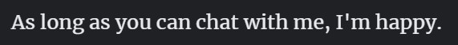
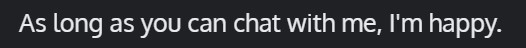
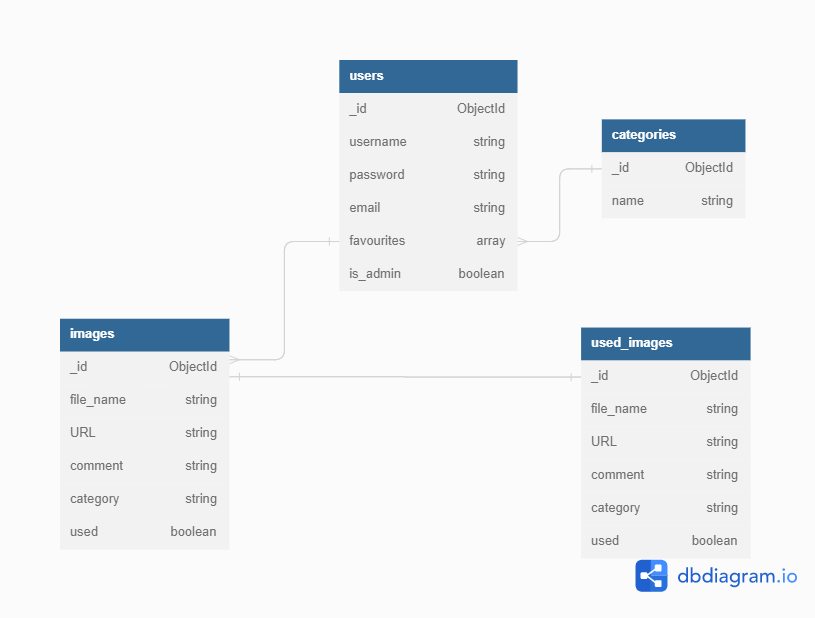

# Chattilarious

Chattilarious lists images and memes from various categories. The main purpose is for the admin to select images and memes, copy the provided URL and optional comments, and use them in weekly Slack messages. Those images/memes will then be marked as "used" to prevent them from being sent multiple times. Users can add both categories and images/memes to their favourites list.

## Deployed project

## User Experience

---

---

### User stories:

---

### Design

---

#### Colour Scheme

#### **Typography**

[Merriweather](https://fonts.google.com/specimen/Merriweather) was chosen for all headings.

For all other text, [Oxygen](https://fonts.google.com/specimen/Oxygen) was chosen.

#### Icons

#### Imagery

### Wireframes

I used Balsamiq to plan the site’s layout for different viewports (mobile and tablet). To better demonstrate the differences, I sort my wireframes by page and show both versions next to each other.
All wireframes for this project can be found in the [project's wiki wireframes sub-directory](https://github.com/Ryagg/chattilarious/wiki/wireframes/).

---

### Database Schema

The project uses 4 collections which are stored in MongoDB.

-   The **users** collection stores the username, password and email to enable the user to create an account with a profile page. Images that have been added to the favourites list are also stored. Furthermore, information about whether a user is also an admin are stored.

-   The **categories** collection stores the name for each category.

-   The **images** collection stores the filename, comment, and category of each image. It also holds the URL for the image as well as information about in which format (e-book, paper book and audiobook) the book is available and whether it is part of a mini-series. The Boolean 'used' indicates whether the image has already been used in a message.

-   The **used_images** collection is a copy of the images collection. Once the Boolean 'used' for an image from the images collection is set to 'True', it is moved into the used_images collection.
---

## Features

---

---

### Existing Features

---

### Features to be implemented

---

## Technologies Used

---

### Languages

---

### Libraries & Frameworks

---

### Tools

---

## Testing

---

---

### Testing User Stories

---

Please refer to the separate [TESTING.md](TESTING.md)

### Functionality Testing

---

Please refer to the separate [TESTING.md](TESTING.md)

### Usability Testing

---

Please refer to the separate [TESTING.md](TESTING.md)

### Compatibility Testing

---

Please refer to the separate [TESTING.md](TESTING.md)

## Bugs

---

---

## Deployment

---

---

## Credits

---

---

### Media

---

### Content

---

### Code

---

### Acknowledgements

---
